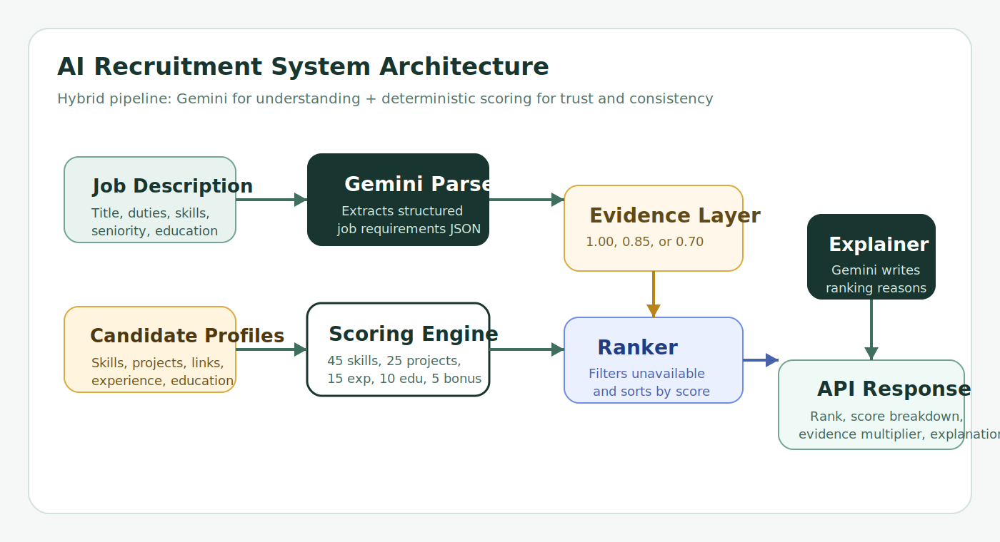
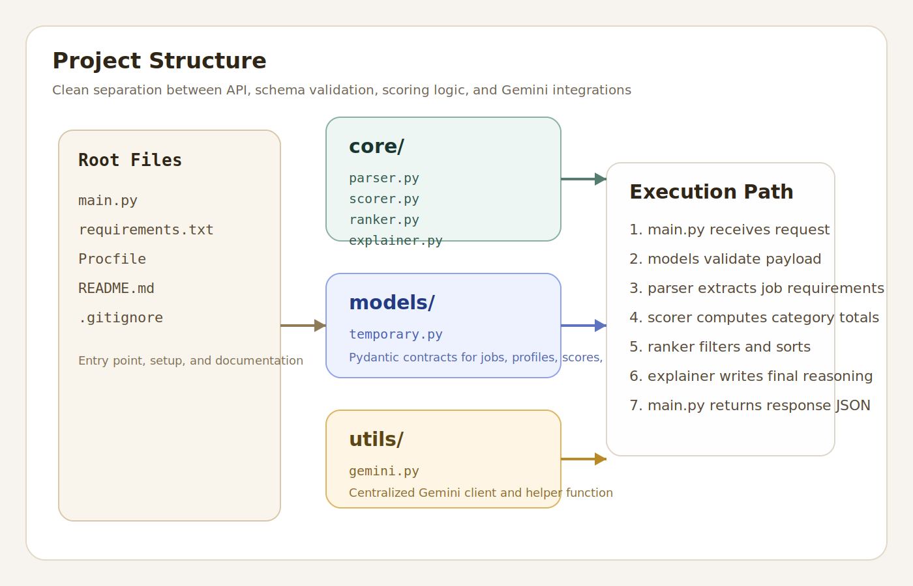
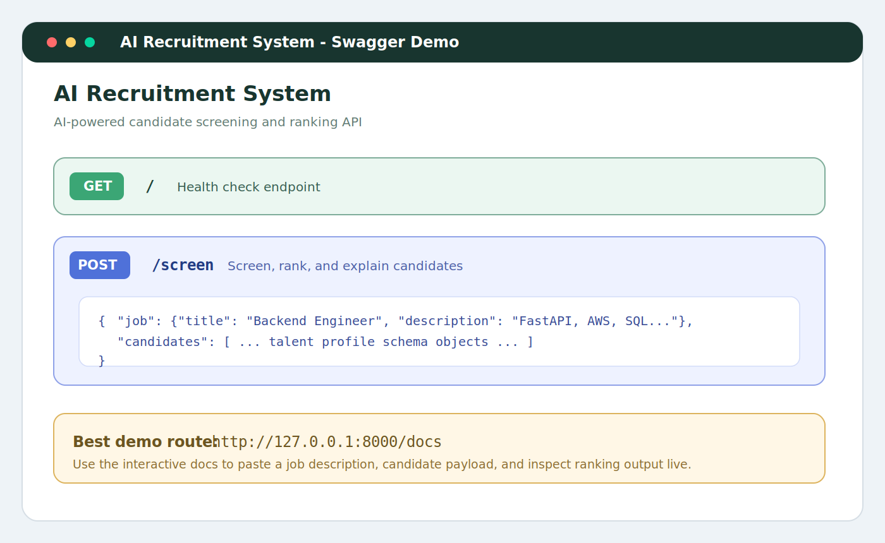
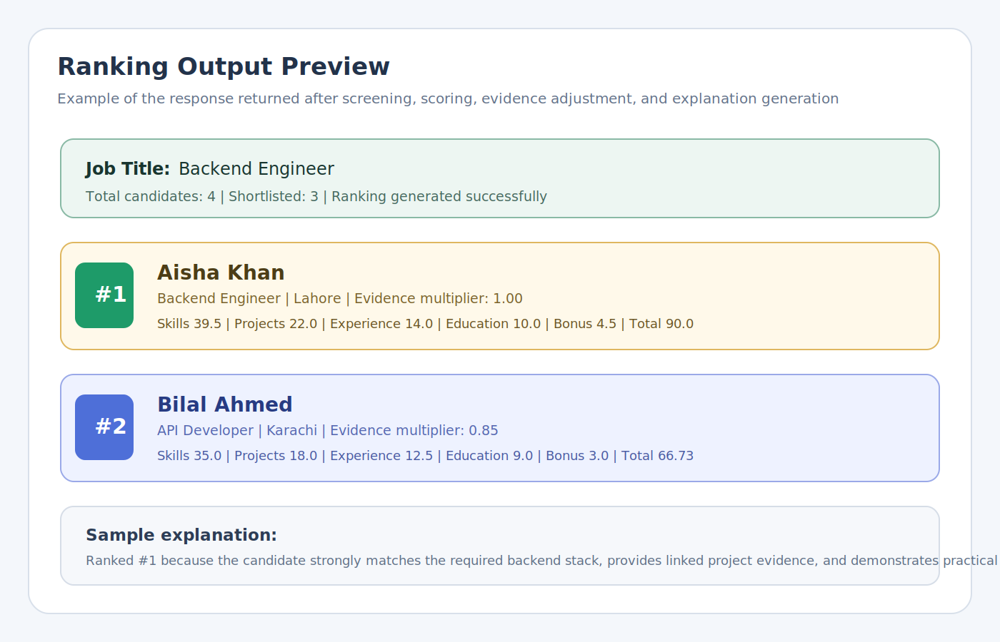
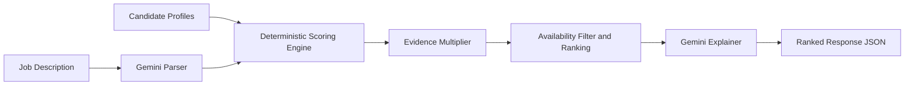

# AI Recruitment System

AI Recruitment System is a competition-ready FastAPI service that shortlists candidates against a job description using a hybrid pipeline:

- Gemini parses the job description into structured hiring requirements.
- Deterministic scoring evaluates skills, projects, experience, education, and bonus factors.
- An evidence multiplier rewards profiles with proof such as GitHub, portfolio links, project links, and certifications.
- Gemini generates plain-language explanations for ranked candidates.

## Demo Gallery

### 1. System Architecture



### 2. Project Structure



### 3. API Demo Preview



### 4. Ranking Output Preview



## What This Project Solves

Hiring teams often face two problems at the same time:

1. Manual screening does not scale when applications increase.
2. Pure keyword matching is fast, but it is weak, opaque, and easy to game.

This project solves both by combining LLM-based understanding with transparent rule-based scoring. The result is a system that is explainable enough for demos and structured enough for engineering handoff.

## Core Flow



## Why The System Is Trustworthy

This system does not fully trust self-claimed profile data. It applies an evidence multiplier after the raw score is calculated.

| Evidence signal | Why it matters |
| --- | --- |
| GitHub link | Shows code-level proof of technical work |
| Portfolio link | Shows visible proof of shipped work |
| Project links | Verifies projects are more than text claims |
| Certifications | Adds third-party validation |

### Evidence multiplier logic

| Evidence ratio | Multiplier | Interpretation |
| --- | --- | --- |
| `>= 0.75` | `1.00` | High trust |
| `>= 0.40` | `0.85` | Partial trust |
| `< 0.40` | `0.70` | Low trust |

This means two candidates with similar claimed skills can still rank differently if one candidate backs those claims with stronger evidence.

## Scoring Framework

The scoring engine lives in [`core/scorer.py`](core/scorer.py) and uses a weighted 100-point framework.

| Category | Weight | What is evaluated |
| --- | --- | --- |
| Skills | 45 | Required and preferred skill alignment, skill level, years of experience |
| Projects | 25 | Tech relevance, project links, project description quality |
| Experience | 15 | Total years, tech overlap with role, experience fit |
| Education | 10 | Degree level and field match |
| Bonus | 5 | Certifications, social links, availability fit |

After the raw score is calculated, the evidence multiplier is applied to produce the final total.

## Project Structure

```text
ai-recruitment-system-master/
|-- main.py
|-- requirements.txt
|-- Procfile
|-- core/
|   |-- parser.py
|   |-- scorer.py
|   |-- ranker.py
|   `-- explainer.py
|-- models/
|   `-- schemas.py
|-- utils/
|   `-- gemini.py
`-- assets/
    |-- architecture-flow.svg
    |-- project-structure.svg
    |-- demo-docs.svg
    `-- demo-ranking.svg
```

### Module responsibilities

- [`main.py`](main.py): FastAPI app, routes, response shaping.
- [`core/parser.py`](core/parser.py): asks Gemini to transform raw job text into structured requirements.
- [`core/scorer.py`](core/scorer.py): deterministic scoring and evidence multiplier logic.
- [`core/ranker.py`](core/ranker.py): filters unavailable candidates and sorts by score.
- [`core/explainer.py`](core/explainer.py): asks Gemini for human-readable ranking explanations.
- [`models/schemas.py`](models/schemas.py): Pydantic models for jobs, candidates, scores, and responses.
- [`utils/gemini.py`](utils/gemini.py): Gemini client configuration and request helper.

## API Design

### Base routes

- `GET /` - health check
- `POST /screen` - parse, score, rank, and explain candidates

### Health check response

```json
{
  "status": "running",
  "message": "AI Recruiting System is live"
}
```

### Screening request shape

```json
{
  "job": {
    "title": "Backend Engineer",
    "description": "We need a Python backend engineer with FastAPI, SQL, AWS, and at least 3 years of experience."
  },
  "candidates": [
    {
      "id": "cand-001",
      "firstName": "Aisha",
      "lastName": "Khan",
      "email": "aisha@example.com",
      "headline": "Backend Engineer",
      "location": "Lahore",
      "skills": [
        { "name": "Python", "level": "Expert", "yearsOfExperience": 5 },
        { "name": "FastAPI", "level": "Advanced", "yearsOfExperience": 3 }
      ],
      "experience": [
        {
          "company": "TechNova",
          "role": "Backend Engineer",
          "startDate": "2021-01",
          "endDate": "Present",
          "technologies": ["Python", "FastAPI", "PostgreSQL", "AWS"],
          "isCurrent": true
        }
      ],
      "education": [
        {
          "institution": "NUST",
          "degree": "Bachelor's",
          "fieldOfStudy": "Computer Science",
          "startYear": 2016,
          "endYear": 2020
        }
      ],
      "projects": [
        {
          "name": "Hiring Analytics API",
          "description": "Built an API for hiring analytics and recruiter dashboards.",
          "technologies": ["Python", "FastAPI", "PostgreSQL"],
          "link": "https://github.com/example/hiring-api"
        }
      ],
      "certifications": [
        {
          "name": "AWS Certified Developer",
          "issuer": "Amazon"
        }
      ],
      "availability": {
        "status": "Available",
        "type": "Full-time"
      },
      "socialLinks": {
        "linkedin": "https://linkedin.com/in/aisha",
        "github": "https://github.com/aisha",
        "portfolio": "https://aisha.dev"
      }
    }
  ]
}
```

### Screening response shape

```json
{
  "jobTitle": "Backend Engineer",
  "totalCandidates": 1,
  "shortlisted": 1,
  "results": [
    {
      "rank": 1,
      "candidateId": "cand-001",
      "name": "Aisha Khan",
      "email": "aisha@example.com",
      "headline": "Backend Engineer",
      "location": "Lahore",
      "score": {
        "skills": 39.5,
        "projects": 22.0,
        "experience": 14.0,
        "education": 10.0,
        "bonus": 4.5,
        "total": 90.0
      },
      "evidenceMultiplier": 1.0,
      "explanation": "Ranked #1 because the candidate strongly matches the required backend stack, has relevant project evidence, and demonstrates strong practical alignment with the role."
    }
  ]
}
```

## Local Setup

### 1. Create and activate a virtual environment

```powershell
python -m venv .venv
.\.venv\Scripts\Activate.ps1
```

### 2. Install dependencies

```powershell
.\.venv\Scripts\python.exe -m pip install -r requirements.txt
```

### 3. Add your Gemini API key

Create a `.env` file in the project root:

```env
GEMINI_API_KEY=your_gemini_api_key_here
```

### 4. Run the API

```powershell
.\.venv\Scripts\python.exe -m uvicorn main:app --reload --host 127.0.0.1 --port 8000
```

### 5. Open the app

- Swagger UI: `http://127.0.0.1:8000/docs`
- Health endpoint: `http://127.0.0.1:8000/`

## Current Design Decisions

- Gemini is mandatory for job parsing and natural-language explanations.
- Candidate scoring is deterministic to keep ranking stable and explainable.
- Candidates with `Not Available` status are filtered out before ranking.
- If Gemini returns invalid JSON during parsing, the parser falls back to a safe empty-requirements structure.
- If explanation generation fails, the system still returns a deterministic fallback summary.

## Competition Value

This project stands out because it is not just another ATS clone:

- It combines AI understanding with transparent scoring.
- It adds a trust mechanism instead of blindly accepting profile claims.
- It produces recruiter-friendly explanations that are easy to present to judges.
- It is already packaged as an API, which makes backend integration straightforward.

## Future Improvements

- Add resume file upload and automatic profile extraction.
- Persist jobs, candidates, and screening sessions in a database.
- Build a custom recruiter dashboard instead of relying only on Swagger.
- Add unit tests for scoring edge cases and prompt-response validation.
- Introduce bias checks and score audit logs for governance.
